# LQC

Deployment of Learning-based Quadrupedal Controller.

## Setup

Tested on Ubuntu 20.04.

```shell
sudo apt install libeigen3-dev libyaml-cpp-dev
git clone https://github.com/JewelryForge/lqc.git --recursive
```

## Build

```shell
cd lqc
cmake -Bbuild [-D<option>=<value>] . 
cmake --build build
cmake --install build --prefix lqc
```

Supported options:
- `LQC_ROBOT`: Controlled robot type, `aliengo`, `go1`, or `b1`.
- `LQC_RUNTIME`: Network inference engine, currently only support `onnxruntime`.

## Run

```shell
# [Suggested] gives permission to set thread priority
sudo setcap 'CAP_SYS_NICE=ep' ./lqc/bin/lqc
sudo ldconfig $PWD/lqc/lib 
./lqc/bin/lqc
```

Supported environmental variables:
- `LQC_COMM_CPUID`: Which CPU core to bind the communication thread with.
- `LQC_AGENT_CPUID`: Which CPU core to bind the agent thread with.
- `LQC_VERBOSE`: Verbose level ranging from 0, 1, 2. Higher prints more information.
- `LQC_GAMEPAD_TYPE`: Gamepad mapping type, `PS` or `Xbox` (default: `Xbox`).

Below is the state machine of locomotion. 
An XBox gamepad is used for sending commands of state transition and desired velocity.

<p align="middle">
  
</p>

If the robot is going to fall ($\textrm{abs}(roll) > \pi/3$ or $\textrm{abs}(pitch) > \pi/3$), 
the robot automatically goes into *disabled* mode.


## Integrations

### ROS

LQC supports ROS communications. Clone this project to a ROS workspace and build:
```shell
cd <your_ws>/src
git clone https://github.com/JewelryForge/lqc.git --recursive
cd ../
catkin_make
```

Catkin recognizes `lqc/integrations/lqc-ros` as a ROS package. Run:
```shell
# make sure to run at the top directory of the workspace
rosrun lqc-ros setcap.sh
rosrun lqc-ros lqc_node
```

