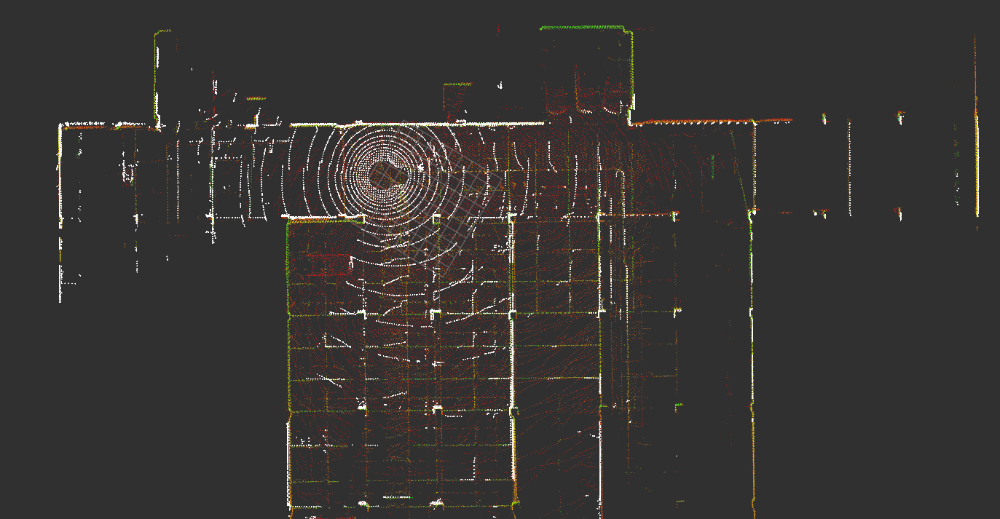
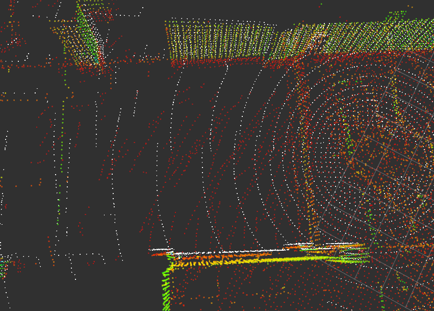
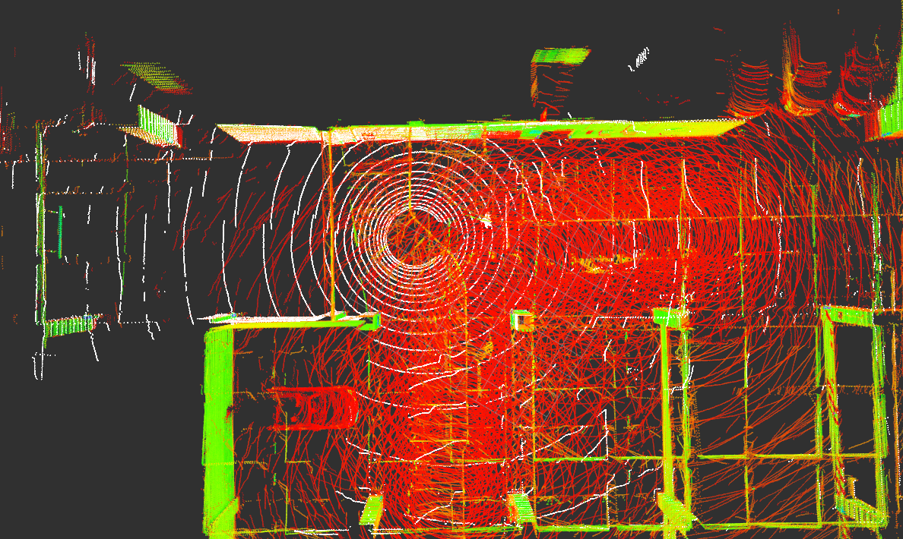
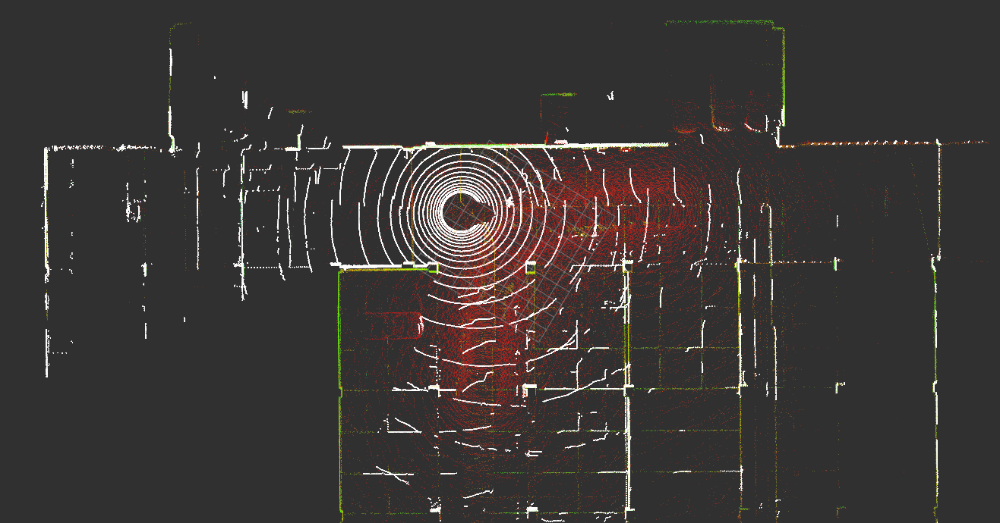

# 点云配准测试记录

本文档描述闭环检测时点云配准的测试记录，旨在寻找准确的点云配准方法。

- [点云配准测试记录](#点云配准测试记录)
  - [测试数据](#测试数据)
  - [测试记录](#测试记录)
    - [ICP测试](#icp测试)
  - [NDT测试](#ndt测试)
  - [GICP测试](#gicp测试)


## 测试数据

测试数据选用海智中心停车场的其中有一帧闭环数据。

## 测试记录

### ICP测试

- 先降采样再ICP

  ```c++
  Eigen::Matrix4f ICPRegistration(CloudTypePtr& _target_cloud,
                                CloudTypePtr& _source_cloud,
                                Eigen::Matrix4f _init_mat) {
  utils::DownsampleCloud(*_target_cloud, 0.2);
  utils::DownsampleCloud(*_source_cloud, 0.2);

  pcl::IterativeClosestPoint<PointType, PointType> icp;
  icp.setMaxCorrespondenceDistance(150);
  icp.setMaximumIterations(100);
  icp.setTransformationEpsilon(1e-6);
  icp.setEuclideanFitnessEpsilon(1e-6);
  icp.setRANSACIterations(0);

  icp.setInputTarget(_target_cloud);
  icp.setInputSource(_source_cloud);

  CloudType final_cloud;
  icp.align(final_cloud, _init_mat);

  std::cout << "Score : " << icp.getFitnessScore() << std::endl;

  return icp.getFinalTransformation();
  }
  ```

  **配准效果**
    配准结果不佳。 ICP score : 0.112516
  
  


## NDT测试

- 使用NDT-OMP
  ```c++
  Eigen::Matrix4f NdtRegistration(CloudTypePtr& _target_cloud,
                                CloudTypePtr& _source_cloud,
                                Eigen::Matrix4f _init_mat) {
  NdtScanMatcher matcher(1.0, 0.5, 4);
  matcher.SetTargetCloud(_target_cloud);
  Eigen::Matrix4f final_transf;
  matcher.Match(_source_cloud, _init_mat, final_transf);
  std::cout << "Score : " << matcher.GetMatchScore() << std::endl;
  return final_transf;
  }
  ```
**配准效果**
配准效果挺好



  
## GICP测试

**配准效果**
配准效果挺好

